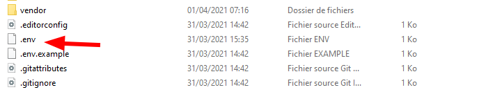

<div align="center">
  <br>
  
  <h1>GESTION DE DISQUE</h1>
  <strong>Application web de gestion de disque developpée avec le framework javascript vuejs et le framework PHP Laravel . </strong>
</div>
<br>

### 📖 prérequis
- [git](https://git-scm.com/downloads)
- [mysql](https://www.mysql.com/fr/downloads/)
- [php](https://nodejs.org/en/): version 7.4
- [nodejs](https://nodejs.org/en/): Je récommande [nvm](https://github.com/nvm-sh/nvm#installing-and-updating) pour basculer entre plusieurs versions facilement.
- [composer](https://getcomposer.org/download/)

### NB: se déplacer à la racine du projet  pour exécuter les commandes suivantes

### 🖥️ Installation en local

- Lancer la commande suivante pour installer les dépendances de Laravel
```
composer install
```

- S'assurer que le fichier <b>.env</b> à la racine du projet

- créer votre base de donnée mysql , exemple de nom `gestion-de-disque`
- si ce n'est pas le cas alors copier le fichier `.env.example` à l'aide de la commande suivante
  
 Pour les utilisateur `Linux`
```
cp .env.example .env
```

Puis modifier le fichier `.env` pour indiquer les `paramètres` de connexion à la `base de donnée`

```
DB_CONNECTION=mysql
DB_HOST=127.0.0.1
DB_PORT=3306
DB_DATABASE=gestion-de-disque
DB_USERNAME=root
DB_PASSWORD=123456
```

-  Générer une clé d'utilisation pour l'application`Laravel`
```
php artisan key:generate
```

-  tapez la commande suivante pour créer un lien symbolique , utile pour accéder aux fichiers situés dans le répertoire storage

```
php artisan storage:link
```

- Créer les tables et charger les `données initiales`

```
php artisan migrate:fresh --seed
```
- Générer une clé pour jwt

```
php artisan jwt:secret
```

- Démarrer le serveur PHP sur le `8080` pour se connecter à l'application `web`


```
php artisan serve
```

Donc vous pouvez lancer `l'application web` dans votre navigateur web à l'adresse :
```
http://127.0.0.1:8000
```
### IDENTIFIANT DE TEST
<table>
    <tr>
        <td> <b>Email</b></td>
        <td>esolinble@gmail.com</td>
    </tr>
    <tr>
        <td> <b>mot de passe </b></td>
        <td>123456</td>
    </tr>
</table>

## 🧪 ️ CAPTURE D'ECRAN
#### Page des disques - Affichage des Informations sur les disques


#### Login - Formulaire de connexion


##  AUTEUR
<table>
    <tr>
        <td> <b>Nom</b></td>
        <td>Anderson Ble</td>
    </tr>
    <tr>
        <td> <b>Email</b></td>
        <td>esolinble@gmail.com</td>
    </tr>
</table>


## ⚖️ LICENSE

MIT © 
